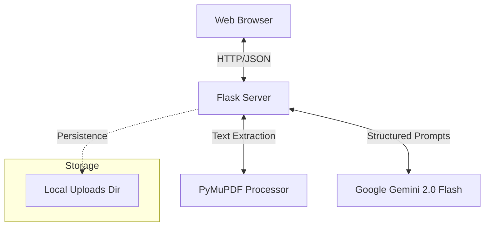

# System Architecture & Design: AI Career Architect

## 1. Overview
The **AI Career Architect** is a specialized resume analysis and career optimization platform. It utilizes Large Language Models (LLMs) to bridge the gap between job seekers and Applicant Tracking Systems (ATS), providing high-fidelity feedback and actionable career roadmaps.

## 2. System Architecture

The application follows a classic Client-Server architecture with an integrated Intelligence Layer.

### 2.1. Frontend Layer
- **Technology**: HTML5, Vanilla CSS (Glassmorphism), JavaScript.
- **Design Philosophy**: High-impact visual design for "Hackathon Winning" aesthetics. Uses a dashboard approach to present complex metrics in a digestible format.
- **Responsiveness**: Mobile-first design principles.

### 2.2. Backend Layer
- **Framework**: Flask (Python).
- **Core Responsibilities**:
    - **File Orchestration**: Securely handles PDF uploads.
    - **Extraction Engine**: Uses `PyMuPDF` (`fitz`) to extract raw text from PDF documents while maintaining readability.
    - **Analysis Bridge**: Coordinates the interaction between the extracted text, job description, and the Gemini API.

### 2.3. Intelligence Layer (The "Brain")
- **Engine**: Google Gemini 2.0 Flash (`gemini-2.0-flash-lite`).
- **Design Pattern**: Multi-Agent Persona Orchestration.
- **Response Format**: Strict JSON enforcement using `response_mime_type: application/json`.

## 3. Detailed Logic & Design

### 3.1. The Intelligence Persona
The system doesn't just "ask" an LLM; it orchestrates a specialized ensemble:
1.  **The Cynical Scanner (ATS)**: Focuses on keyword density, formatting issues, and quantification metrics.
2.  **The Google Bar Raiser**: Evaluates technical depth and the impact of accomplishments using the X-Y-Z formula.
3.  **The Visionary Mentor**: Maps current skills to market demand and future growth.

### 3.2. Data Flow
1.  **Ingestion**: User uploads a Resume (PDF) and a Job Description (Text).
2.  **Processing**: `PyMuPDF` converts the PDF binary into clean UTF-8 text.
3.  **Context Construction**: The system builds a hyper-detailed prompt containing the extracted text, the JD, and specific JSON schema instructions.
4.  **Inference**: Gemini processes the multi-persona prompt and returns a structured JSON object.
5.  **Visualization**: The Flask backend passes this JSON to the frontend templates, where dynamic JavaScript renders the scorecharts and roadmaps.

## 4. Technical Stack
| Component | Technology | Rationale |
| :--- | :--- | :--- |
| **Language** | Python 3.9+ | Ecosystem support for AI and web. |
| **Web Server** | Flask | Lightweight, easy to deploy for prototypes/hackathons. |
| **PDF Engine** | PyMuPDF | Fastest and most reliable text extraction for complex layouts. |
| **AI Model** | Google Gemini 2.0 Flash | Low latency, high reasoning capability, native JSON support. |
| **Environment** | python-dotenv | Secure secret management. |

## 5. Design Considerations

### 5.1. Performance
- **Latency**: Using `gemini-2.0-flash-lite` ensures that the complex multi-persona analysis completes in < 3 seconds.
- **Efficiency**: Text extraction is done in-memory before passing to the API to minimize disk I/O.

### 5.2. Error Handling
- **Graceful Failure**: If the LLM returns malformed JSON or fails, the system provides diagnostic info and a "System Breach" error message rather than a hard crash.
- **Validation**: JSON is parsed via `json.loads` on the server-side to guarantee integrity before rendering.

### 5.3. Security
- **File Handling**: Uploads are restricted to `.pdf` extensions.
- **API Security**: Keys are managed via environment variables and never hardcoded.
