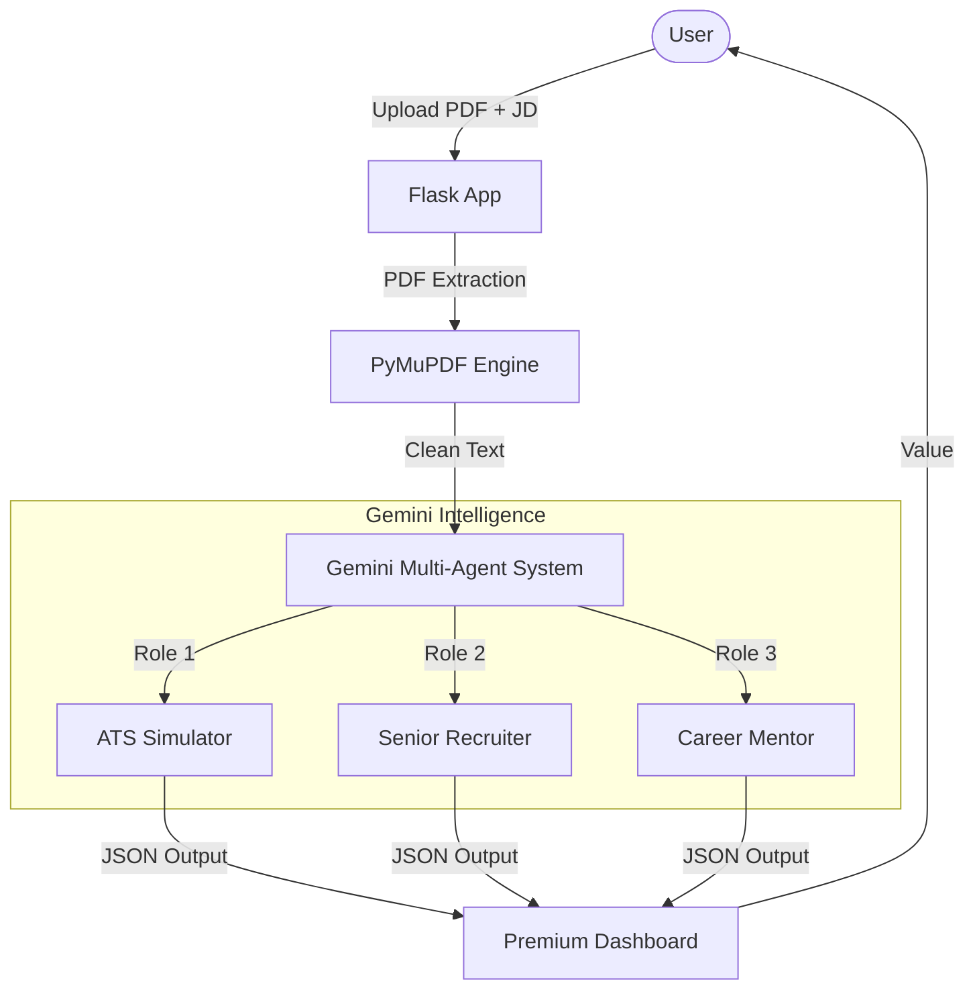

# 🧠 AI Career Architect (Resume & Career Intelligence)

**Winner Material: Built for Hackathons | Powered by Google Gemini**

[](https://aistudio.google.com/app/apikey)
[](https://flask.palletsprojects.com/)
[](https://opensource.org/licenses/MIT)

## 🔴 The Problem: "The Black Hole of Applications"
Millions of talented students apply to 100+ jobs and get rejected instantly by "The Machine" (ATS) without ever knowing why. They operate in the dark, tweaking bullet points at random, losing confidence, and wasting months.

## ✨ The Winning Solution
**AI Career Architect** is not just a resume checker; it's a multi-perspective intelligence engine. It personifies an **ATS Simulator**, a **Cynical Senior Recruiter**, and a **FAANG Mentor** to provide:
1.  **ATS Score Breakdown**: Deep scanning for keyword and skill matches.
2.  **Honest Recruiter Feedback**: Brutally honest reasons for rejection/shortlisting.
3.  **FAANG-Ready Tailoring**: Rewriting bullets using the Google X-Y-Z formula.
4.  **6-Month Roadmap**: Personalised learning plan to bridge skill gaps.

## 🏗️ Architecture & Flow


## 🛠️ Tech Stack & Google Deep-Dive
-   **Core AI Engine**: `Google Gemini 1.5 Flash` (Fast, Multimodal, and Logic-Rich)
-   **Structured Intelligence**: Utilizing `response_mime_type: application/json` for deterministic UI updates.
-   **Backend**: `Python/Flask` (Scalable and Lightweight)
-   **Frontend**: `Premium Glassmorphism UI` (Designed for visual impact)
-   **Parsing**: `PyMuPDF` for high-fidelity text extraction.

## 🚀 Installation & Setup
1.  Clone the repository:
    ```bash
    git clone https://github.com/your-username/AI-Career-Architect.git
    cd AI-Career-Architect
    ```
2.  Install dependencies:
    ```bash
    pip install -r requirements.txt
    ```
3.  Setup Environment:
    Create a `.env` file and add your `GEMINI_API_KEY`.
4.  Run the engine:
    ```bash
    python main.py
    ```

## 🔮 Future Scope
-   **LinkedIn Deep-Sync**: Automatic profile optimization.
-   **Mock Interview AI**: Voice-based interactive practice.
-   **Multi-Lingual Support**: Analyzing resumes in global languages.
-   **Recruiter Dashboard**: Allowing companies to find "Hidden Gems".

## 📜 License
MIT © 2026 AI Career Architect
