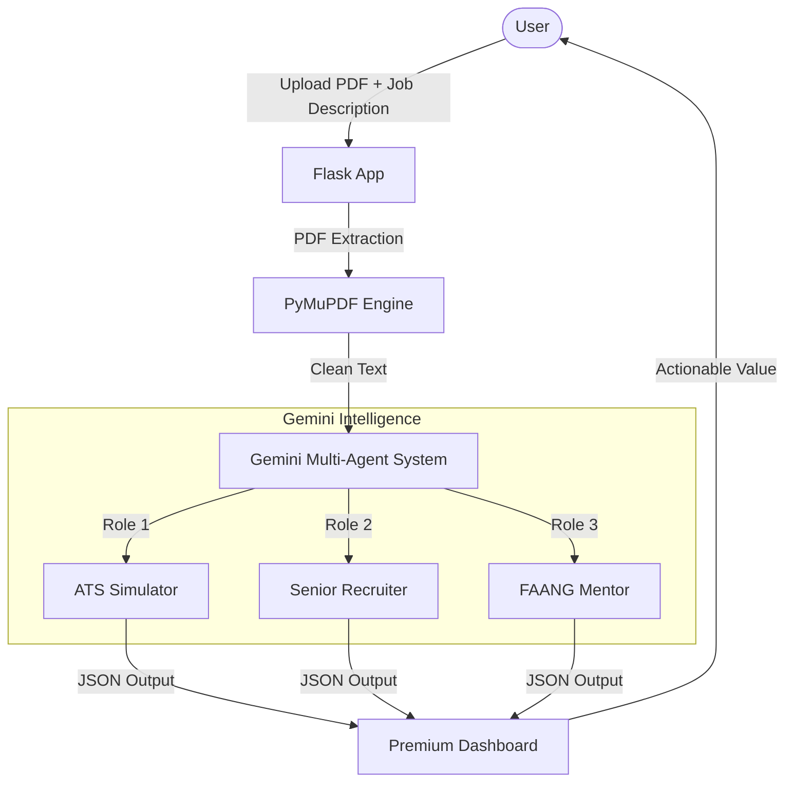

# 🧠 AI Career Architect — Resume & Career Intelligence

[](https://aistudio.google.com/app/apikey) [](https://flask.palletsprojects.com/) [](https://opensource.org/licenses/MIT)

AI Career Architect is an intelligent, end-to-end resume and career coaching assistant designed to help students and early-career professionals escape the "black hole" of automated rejections and get into the interview funnel with confidence. Built for hackathons and rapid iteration, the system combines high-fidelity PDF parsing with a multi-agent AI backbone powered by Google Gemini to provide actionable, prioritized guidance.

Table of contents
- Problem
- Solution overview
- Key features
- Architecture & data flow
- Scoring & output format
- Installation and development setup
- Usage (CLI / API / Example)
- Security & privacy
- Testing & CI
- Roadmap
- Contributing
- License & credits

## 🔴 Problem statement — "The Black Hole of Applications"
Many applicants—especially students and early-career professionals—submit dozens or hundreds of applications and are rejected automatically by Applicant Tracking Systems (ATS) without any feedback. Common pain points:
- No clear signal why an application fails
- Random, inefficient resume edits in hope of matching job descriptions
- Low motivation after repeated rejections
- Lack of structured learning plan to bridge real skill gaps

## ✨ Solution overview
AI Career Architect provides a multi-perspective analysis of a resume against a job description:
- Simulates ATS behavior (keyword, skills & context matching)
- Emulates a cynical senior recruiter for candid feedback
- Acts as a FAANG-style mentor to rewrite bullets using an impact-first formula and recommend a 6‑month learning plan

This results in:
- Deterministic, structured outputs suitable for a product dashboard
- Prioritised, actionable steps to improve both resume and skillset
- Templates and rewritten bullets that are recruiter- and FAANG-friendly

## 🏷️ Key features
- ATS Score Breakdown: granular evaluation of keywords, skills, role fit, and formatting issues
- Recruiter Feedback: human-like, candid commentary explaining likely rejection reasons
- FAANG-Ready Bullet Rewrites: suggested bullet points following the Google X-Y-Z / Impact formula
- Personalised 6‑month Roadmap: learning plan with milestones and recommended resources
- PDF parsing: robust extraction of resume text using PyMuPDF
- Deterministic outputs: JSON-first response format and structured agent outputs for consistent UI rendering

## 🏗️ Architecture & flow



High level:
1. User uploads resume PDF and a target job description (JD).
2. Backend extracts and normalises text (PyMuPDF), then sends structured prompts to a multi-agent Gemini system.
3. Each agent returns deterministic JSON (via `response_mime_type: application/json`) describing scores, feedback, rewritten bullets, and a personalised learning roadmap.
4. Frontend/ dashboard consumes the JSON and renders an actionable UI.

## 🔬 Scoring methodology (high level)
- Keyword match (30%): exact matches, stemming, synonyms, and context-aware embeddings
- Skills & tools relevance (25%): domain-specific skills with weightings per JD
- Experience fit (25%): seniority level, quantifiable achievements, role-specific responsibilities
- Format & readability (10%): parsed structure, section labels, contact info, file integrity
- Actionability (10%): presence of metrics, outcome-oriented bullets

The scoring engine exposes a per-category score and a combined ATS score in the output JSON to allow transparent UI breakdowns.

## 📦 Output format (example)
All agents return structured JSON suitable for UI rendering. Example (abbreviated):

```json
{
  "ats": {
    "score": 62,
    "breakdown": {
      "keywords": 70,
      "skills": 55,
      "experience": 60,
      "format": 90,
      "actionability": 30
    },
    "matched_keywords": ["react", "nodejs", "rest api"],
    "missing_high_priority_skills": ["system design", "scalability"]
  },
  "recruiter_feedback": {
    "summary": "Resume shows strong frontend experience but lacks scale and leadership examples.",
    "detailed": [
      "Bullets are task-focused; emphasise outcomes and metrics.",
      "Multiple JDs require backend integrations; add Node/Express projects with metrics."
    ]
  },
  "mentor_rewrites": [
    {
      "original": "Worked on a web app with React",
      "rewrite": "Led development of a React-based web application used by 10k+ monthly users; reduced page load time by 40% via code-splitting and lazy-loading."
    }
  ],
  "learning_plan": {
    "horizon_months": 6,
    "milestones": [
      {"month": 1, "goal": "Core system design concepts"},
      {"month": 3, "goal": "Build and deploy a full-stack project with metrics"}
    ],
    "resources": [
      {"title": "System Design Primer", "url": "https://example.com"}
    ]
  }
}
```

## 🚀 Installation & Quickstart

Prerequisites
- Python 3.10+
- pip
- (Optional) virtualenv / venv
- Google Gemini API access or a compatible LLM endpoint

1. Clone the repository
```bash
git clone https://github.com/ShreyaRHipparagi/ai-ats-resume-analyzer.git
cd ai-ats-resume-analyzer
```

2. Create virtual environment and install
```bash
python -m venv .venv
source .venv/bin/activate   # macOS / Linux
.venv\Scripts\activate      # Windows
pip install -r requirements.txt
```

3. Environment variables
Create a `.env` file in the project root with the following (example):
```
GEMINI_API_KEY=your_gemini_api_key_here
FLASK_ENV=development
FLASK_APP=main.py
DEBUG=true
```

4. Run the application (development)
```bash
python main.py
```
By default the Flask backend serves API endpoints described below. See production deployment notes in the "Deployment" section.

## 🧭 API endpoints (example)
- POST /api/analyze
  - Payload: multipart/form-data or JSON:
    - resume: PDF file (multipart) OR resume_text (string)
    - job_description: text
    - options: { "model": "gemini-1.5-flash", "strict_mode": true }
  - Response: agent JSON (ATS + recruiter + mentor outputs)

- GET /api/status
  - Health check for service and LLM connectivity

Example cURL (resume file upload):
```bash
curl -X POST http://localhost:5000/api/analyze \
  -F "resume=@/path/to/resume.pdf" \
  -F "job_description=$(< job_description.txt)"
```

## 🛡️ Privacy & Security
- Resume data is private by default. Implementations should:
  - Encrypt data at rest
  - Delete uploaded files after processing (or offer user-controlled retention)
  - Use secure API keys through environment variables and secrets management systems
- If using third-party LLM endpoints, ensure data privacy agreements and encryption in transit (HTTPS).

## ✅ Testing & CI
- Unit tests for parsing, normalization and scoring pipeline
- Integration tests that mock LLM responses for deterministic checks
- Recommended: GitHub Actions for:
  - linting (flake8 / black)
  - unit tests (pytest)
  - dependency scanning (safety / pip-audit)

Example GitHub Actions job (snippet)
```yaml
name: CI
on: [push, pull_request]
jobs:
  test:
    runs-on: ubuntu-latest
    steps:
      - uses: actions/checkout@v4
      - uses: actions/setup-python@v4
