# 🧠 AI Career Architect — Resume & Career Intelligence

[](https://aistudio.google.com/app/apikey) [](https://flask.palletsprojects.com/) [](https://developer.mozilla.org/en-US/docs/Web/CSS) [](https://opensource.org/licenses/MIT)

**AI Career Architect** is an elite, end-to-end resume intelligence platform designed to help professionals escape the "black hole" of automated rejections. By combining high-fidelity PDF parsing with a multi-persona AI orchestration (Google Gemini 2.5 Flash), the system delivers a hyper-visual dashboard of metrics, FAANG-level bullet rewrites, and a personalized 6-month roadmap.

Table of contents
- Problem
- Solution overview
- Key features
- Architecture & data flow
- Scoring & output format
- Installation & development setup
- Usage (CLI / API / Example)
- Deployment
- Security & privacy
- Testing & CI
- Roadmap
- Contributing
- License & credits
- Contact

---

## ✨ Premium Visual Experience
The Architect is not just an analyzer; it's a visual journey.
- **Glassmorphism UI**: High-fidelity translucent cards with backdrop blurs.
- **Mesh Bloom Effects**: Dynamic, animated background blobs that shift based on theme.
- **AOS (Animate On Scroll)**: Staggered, smooth entrance animations for all metrics.
- **Micro-Animations**: Confetti celebrations for high scores and "cyber-spin" loaders.
- **Interactive Data**: Progress rings, skill radars, and animated charts.

---

## 🔴 Problem statement — "The Black Hole of Applications"
Many applicants—especially students and early-career professionals—submit dozens or hundreds of applications and are rejected automatically by Applicant Tracking Systems (ATS) without feedback. Typical pain points:
- No clear signal why an application failed
- Random resume edits hoping to match job descriptions (inefficient)
- Decreasing motivation after repeated rejections
- No structured plan to close real skill gaps

---

## ✨ Solution overview
AI Career Architect performs multi-perspective analysis of a resume against a target job description (JD) using three complementary personas:
1. ATS Simulator — scores keyword & skill matches and identifies formatting issues.
2. Cynical Senior Recruiter — provides candid, recruiter-style feedback and prioritised actions.
3. FAANG Mentor — rewrites bullets using an impact-first formula (Google X-Y-Z) and designs a 6-month learning roadmap.

Outcomes:
- Deterministic, JSON-first outputs for consistent UI rendering
- Prioritised, actionable improvements to resume and skill set
- Rewritten bullets and templates tuned for recruiter and FAANG expectations

### 🎭 The Expert Personas

| Persona | Focus | Mission |
| :--- | :--- | :--- |
| **The Cynical Scanner** | Keywords & Format | To find every reason an ATS would reject your resume. |
| **The Google Bar Raiser** | Impact & Depth | To ensure your experience sounds like a Senior Engineer at a top tech firm. |
| **The Visionary Mentor** | Strategy & Growth | To plot the exact path from where you are to your dream role. |

---

## 🏷️ Key features
- ATS Score Breakdown: granular scoring (keywords, skills, experience, format, actionability)
- Recruiter Feedback: specific, prioritized reasons for rejection or shortlisting
- FAANG-Style Rewrites: impact-first bullet rewrites (metrics, what-you-did, outcome)
- Personalized 6‑Month Roadmap: milestones, goals, and curated learning resources
- Robust PDF parsing: high-fidelity text extraction using PyMuPDF
- Deterministic outputs: JSON schema via `response_mime_type: application/json` for each agent

### 📐 The X-Y-Z Formula
The system optimizes your resume using the gold standard for high-impact resumes:
> **"Accomplished [X] as measured by [Y], by doing [Z]"**

---

## 🏗️ Architecture & flow

```mermaid
graph TD
    %% Styling
    classDef user fill:#f9f,stroke:#333,stroke-width:2px;
    classDef engine fill:#bbf,stroke:#333,stroke-width:2px;
    classDef brain fill:#dfd,stroke:#333,stroke-width:4px;
    classDef out fill:#fdd,stroke:#333,stroke-width:2px;

    User([👤 User]) -->|Upload PDF + JD| Flask[🚀 Flask Application]
    
    subgraph Processing_Layer [Precision Extraction]
        Flask -->|Extract Text| PyMuPDF[📄 PyMuPDF Engine]
        PyMuPDF -->|Clean UTF-8| Normalized[Normalized Context]
    end

    subgraph Intelligence_Layer [The Ensemble Brain]
        Normalized -->|System Prompt| Gemini[[✨ Google Gemini 2.5 Flash]]
        
        subgraph Personas [Specialized Agents]
            Gemini --- P1[📉 THE CYNICAL SCANNER - ATS Metrics]
            Gemini --- P2[🏆 THE BAR RAISER - FAANG Standards]
            P2 -->|X-Y-Z| P1
            Gemini --- P3[🔮 THE VISIONARY - Career Roadmap]
        end
    end

    Gemini -->|Strict JSON| Dashboard[🎨 Premium Glassmorphism Dashboard]
    Dashboard -->|Actionable Growth| User

    %% Styles
    class User user;
    class Flask,PyMuPDF engine;
    class Gemini,P1,P2,P3 brain;
    class Dashboard out;
```



High level flow:
1. User uploads resume PDF and a target job description.
2. Backend extracts and normalises text (PyMuPDF) and prepares structured prompts.
3. Multi-agent Gemini system (ATS, Recruiter, Mentor) returns deterministic JSON payloads.
4. Frontend/dashboard consumes JSON and renders prioritized actions, rewrites, and a learning roadmap.

---

## 🔬 Scoring methodology (high level)
The scoring engine composes a final ATS score from weighted components:

- Keyword match — 30%: exact matches, stemming, synonyms and context-aware embeddings
- Skills & tools relevance — 25%: domain/tool weighting based on JD
- Experience fit — 25%: seniority, role-specific responsibilities, quantifiable achievements
- Format & readability — 10%: section structure, headings, contact info, font/layout issues detected from PDF
- Actionability — 10%: presence of metrics, results-oriented language

Each category produces a sub-score and the engine emits the combined ATS score plus supporting data such as matched keywords, missed high-priority items, and suggestions.

---

## 📦 Output Engine: The Intelligence Schema
The "Brain" emits a high-fidelity JSON payload encompassing everything from market intelligence to interview preparation.

```json
{
  "candidate_info": {
    "name": "Jane Doe",
    "title": "Senior Software Engineer",
    "career_persona": "The Disruptive Systems Architect",
    "readiness_score": 88
  },
  "ats_analysis": {
    "overall_score": 82,
    "section_scores": {
      "quantification": 90,
      "experience": 85,
      "tech_stack": 70,
      "education": 95
    },
    "breakdown": {
      "skill_match": 75,
      "keyword_match": 80,
      "experience_relevance": 85,
      "formatting_quality": 90
    },
    "explanation": "### Analysis Deep-Dive\nYour resume shows **exceptional quantification** in backend roles..."
  },
  "market_intel": {
    "salary_range_usd": "$150k - $190k",
    "salary_range_inr": "₹35L - ₹55L",
    "market_demand": "High",
    "top_competencies": ["Distributed Systems", "Cloud Native", "Go"]
  },
  "advanced_insights": {
    "technical_depth_scouter": "High complexity noted in microservices orchestration.",
    "culture_fit_predictor": "Strong alignment with high-growth startup values.",
    "faang_matchmaker": "Google / Meta",
    "skill_radar": {
      "Technical": 90,
      "Leadership": 75,
      "Communication": 85,
      "Problem Solving": 95,
      "Innovation": 80
    }
  },
  "recruiter_review": {
    "decision": "Shortlisted",
    "honest_feedback": "Resume is punchy and impact-heavy. Backend depth is undeniable.",
    "critical_fail_points": ["Lack of public cloud certification mentioned."],
    "key_strengths": ["Strong ROI focus", "Quantified achievements"]
  },
  "resume_tailoring": {
    "enhanced_bullets": [
      {
        "original": "Worked on a web app",
        "improved": "Engineered a React-based app used by 50k users, reducing load time by 30% by implementing Redis caching.",
        "impact": "Shows scale and measurable performance gains."
      }
    ],
    "cover_letter": "A high-impact, professional cover letter tailored to the target role..."
  },
  "skill_gap_analysis": {
    "missing_technical_skills": ["AWS Solutions Architect", "Terraform"],
    "recommended_projects": [
      {
        "title": "Cloud-Native Infrastructure Bot",
        "description": "Build an automated infra manager using Terraform...",
        "tech_stack": ["Terraform", "Go", "AWS"]
      }
    ]
  },
  "interview_prep": {
    "technical_questions": ["Explain CAP theorem in the context of your last project."],
    "behavioral_questions": ["Tell me about a time you had to pivot a technical decision."]
  }
}
```

Refer to docs/openapi.yaml (planned) for the full schema.

---

## 🚀 Installation & Quickstart

Prerequisites
- Python 3.10+
- pip
- (Optional) virtualenv / venv
- Google Gemini API access (or compatible LLM endpoint) and API key

1. Clone the repository
```bash
git clone https://github.com/ShreyaRHipparagi/ai-ats-resume-analyzer.git
cd ai-ats-resume-analyzer
```

2. Create virtual environment and install
```bash
python -m venv .venv
source .venv/bin/activate   # macOS / Linux
.venv\Scripts\activate      # Windows
pip install -r requirements.txt
```

3. Environment variables
Create a `.env` file in the project root:
```
GEMINI_API_KEY=your_gemini_api_key_here
FLASK_ENV=development
FLASK_APP=main.py
DEBUG=true
```

4. Run the application (development)
```bash
python main.py
```
By default the Flask backend serves API endpoints documented below.

---

## 🧭 API endpoints (example)

- POST /api/analyze
  - Payload: multipart/form-data or JSON
    - resume: PDF file (multipart)
    - job_description: text
    - options: { "model": "gemini-1.5-flash", "strict_mode": true }
  - Response: JSON payload containing ATS score, recruiter feedback, mentor rewrites, and learning plan

- GET /api/status
  - Health check for service and LLM connectivity

Example cURL (resume file upload):
```bash
curl -X POST http://localhost:5000/api/analyze \
  -F "resume=@/path/to/resume.pdf" \
  -F "job_description=$(< job_description.txt)"
```

---

## 📦 Docker & production notes
A production deployment should run the Flask app behind a WSGI server (e.g., Gunicorn) and expose a secure HTTPS endpoint. Example Dockerfile (simplified):

```dockerfile
FROM python:3.10-slim
WORKDIR /app
COPY requirements.txt .
RUN pip install -r requirements.txt
COPY . .
ENV FLASK_ENV=production
CMD ["gunicorn", "--bind", "0.0.0.0:5000", "main:app", "--workers", "4"]
```

Recommendations:
- Use managed secrets (HashiCorp Vault, AWS Secrets Manager, GCP Secret Manager)
- Rate-limit and queue LLM calls to avoid spikes and cost overruns
- Cache repeated JD/resume comparisons for faster results
- Implement file retention policies (auto-delete or user opt-in persistance)
- Monitor LLM call costs and offer user-facing usage quotas for paid tiers

---

## 🛡️ Privacy & Security
- Treat uploaded resumes as sensitive personal data:
  - Encrypt data at rest (AES-256) and in transit (HTTPS/TLS)
  - Offer clear retention and deletion controls
  - Log minimally and redact PII in debug logs
- When using third-party LLMs, ensure contractual data protection and consider on-prem or private LLM deployments for heightened privacy.

---

## ✅ Testing & CI
- Unit tests for parsing, normalization, scoring, and JSON schema validation
- Integration tests that mock LLM responses for deterministic checks
- E2E smoke tests for the API contract

Example GitHub Actions workflow (CI):

```yaml
name: CI
on: [push, pull_request]
jobs:
  test:
    runs-on: ubuntu-latest
    strategy:
      matrix:
        python-version: ['3.10', '3.11']
    steps:
      - uses: actions/checkout@v4
      - name: Setup Python
        uses: actions/setup-python@v4
        with:
          python-version: ${{ matrix.python-version }}
      - name: Install dependencies
        run: |
          python -m venv .venv
          source .venv/bin/activate
          pip install -r requirements.txt
      - name: Lint
        run: |
          source .venv/bin/activate
          pip install flake8 black
          flake8 .
      - name: Run tests
        run: |
          source .venv/bin/activate
          pip install -r requirements.txt
          pytest -q
      - name: Dependency scan
        run: |
          pip install pip-audit
          pip-audit --progress
```

Add secrets for test coverage and code scanning as needed.

---

## 🔭 Roadmap & future scope
Planned enhancements:
- LinkedIn Deep-Sync: adapt profile sections and headlines automatically
- Mock Interview AI: timed, voice-enabled interview practice with feedback
- Multi-lingual analysis and localized JD parsing
- Recruiter dashboard for enterprise customers and ATS integrations
- Offline/local LLM support (self-hosted models) for privacy-sensitive deployments
- OpenAPI/Swagger documentation and SDKs (Python/JS)

---

## 🧩 Extensibility & integration points
- Replace or extend the LLM backend by implementing an adapter interface
- Add personas/agents (Hiring Manager, Diversity & Inclusion reviewer)
- Integrate with ATS vendors or job platforms for direct application submission
- Export rewritten resumes to common templates (PDF, DOCX) with confidence checks

---

## 👩‍💻 Contributing
Contributions welcome! Suggested workflow:
1. Fork the repo
2. Create a feature branch: `git checkout -b feat/my-feature`
3. Add tests and documentation
4. Open a pull request with a clear description and rationale

Please follow the code style (Black + Flake8) and include tests for significant changes. See CONTRIBUTING.md for detailed contributor guidelines (add this file if absent).

---

## 📝 License
MIT © 2026 AI Career Architect — Shreya R. Hipparagi  
Repository: https://github.com/ShreyaRHipparagi/ai-ats-resume-analyzer

## 📦 Technical Stack & Rationale

| Component | Technology | Rationale |
| :--- | :--- | :--- |
| **Intelligence** | **Gemini 2.5 Flash** | Advanced reasoning, massive context, and native JSON intelligence. |
| **Extraction** | **PyMuPDF** | High-fidelity structural parsing of complex PDF layouts. |
| **Animation** | **AOS + Confetti** | Smooth, high-performance entrance and success animations. |
| **Styling** | **Glassmorphism** | Premium, modern aesthetic using advanced CSS blurs and gradients. |

---

## 📝 Credits
- Built with Google Gemini (LLM)
- PyMuPDF for PDF parsing
- Flask for the API backend
- Project scaffold inspired by community best-practices for secure AI services

---

## Contact
Project maintainer: Shreya R. Hipparagi  
Repository: https://github.com/ShreyaRHipparagi/ai-ats-resume-analyzer  
For questions, feature requests, or enterprise inquiries, open an issue or send an email (shreyahipparagi2006@gmail.com).

---
